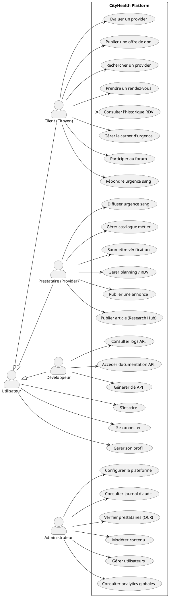
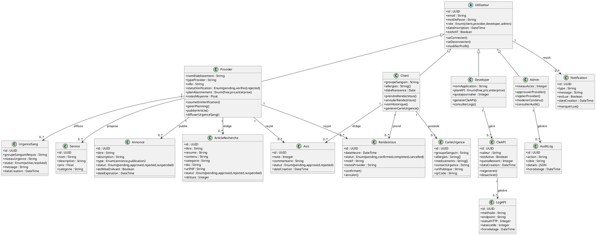
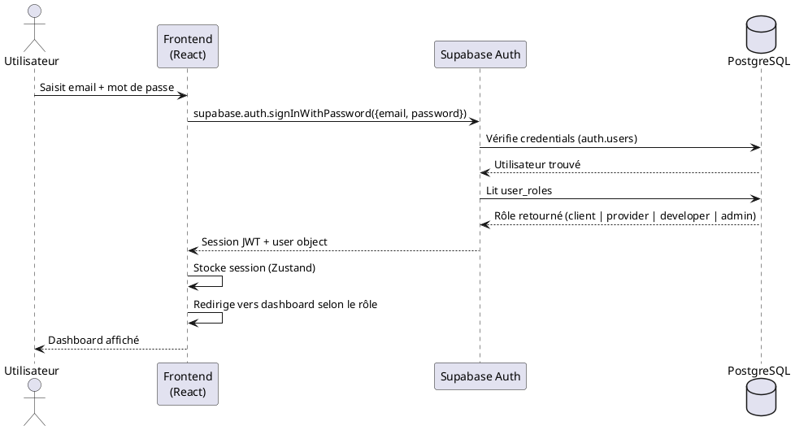
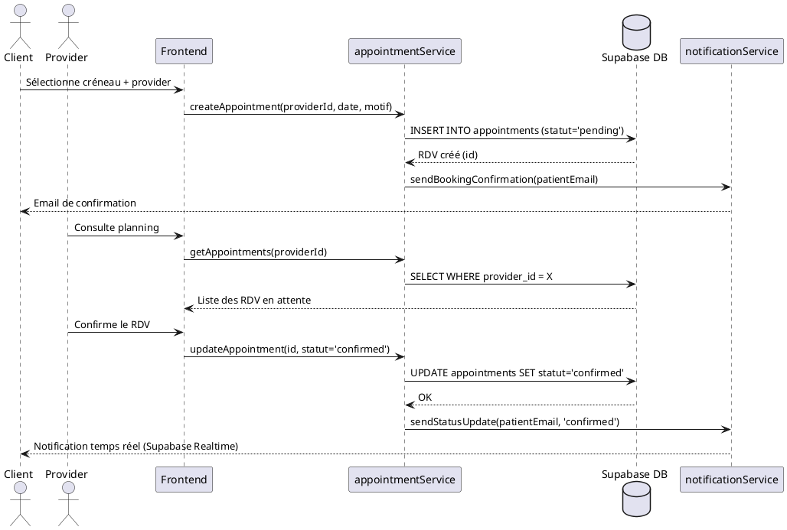
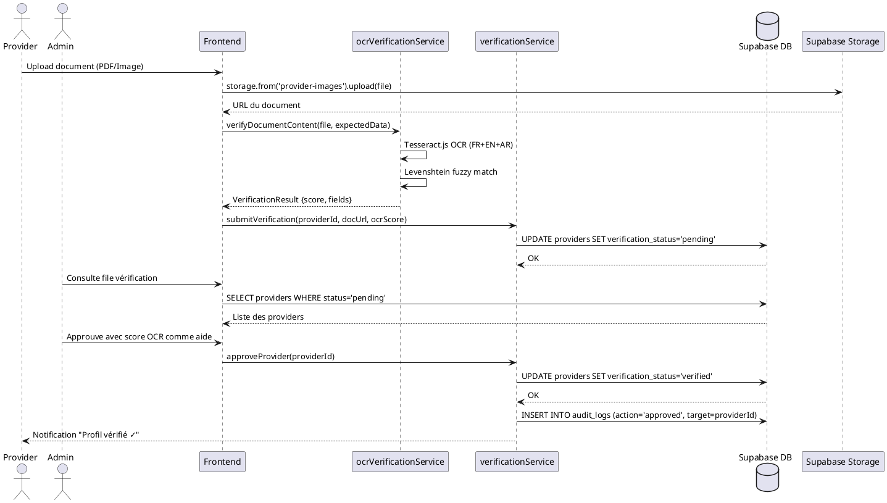
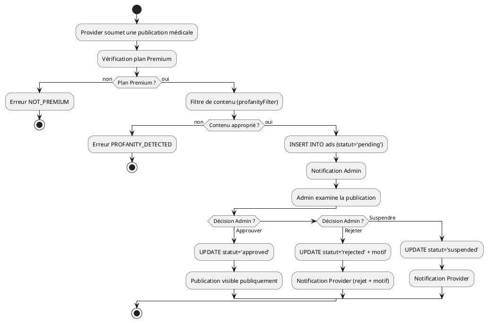

# Package de Modélisation UML + MERISE — CityHealth PFE

---

## 1. UML — Diagramme des Cas d'Utilisation



---

## 2. UML — Diagramme de Classes



---

## 3. UML — Diagramme de Séquence : Authentification



---

## 4. UML — Diagramme de Séquence : Cycle de vie d'un rendez-vous



---

## 5. UML — Diagramme de Séquence : Vérification Provider (OCR)



---

## 6. UML — Diagramme d'Activité : Cycle de vie d'une Publication Médicale



---

## 7. MERISE — Modèle Conceptuel des Données (MCD)

```
UTILISATEUR (id_utilisateur, email, mot_de_passe, role, date_inscription, est_actif)

CLIENT (id_client, groupe_sanguin, allergies, date_naissance)
    hérite de UTILISATEUR

PROVIDER (id_provider, nom_etablissement, type_provider, ville, statut_verification, plan_abonnement, note_moyenne)
    hérite de UTILISATEUR

DEVELOPER (id_developer, nom_application, plan_api, quota_journalier)
    hérite de UTILISATEUR

ADMIN (id_admin, niveau_acces)
    hérite de UTILISATEUR

RENDEZ_VOUS (id_rdv, date_heure, statut, motif, notes_provider)
SERVICE (id_service, nom, description, prix, categorie)
CARTE_URGENCE (id_carte, groupe_sanguin, allergies, medicaments, contact_urgence, url_publique)
ANNONCE (id_annonce, titre, description, type, statut, est_mise_en_avant, date_expiration)
ARTICLE_RECHERCHE (id_article, titre, resume, contenu, categorie, doi, url_pdf, statut, nb_vues)
AVIS (id_avis, note, commentaire, statut, date_creation)
CLE_API (id_cle, valeur, est_active, quota_restant, date_creation)
LOG_API (id_log, methode, endpoint, statut_http, latence_ms, horodatage)
URGENCE_SANG (id_urgence, groupe_sanguin_requis, niveau_urgence, statut, message)
NOTIFICATION (id_notif, type, message, est_lue, date_creation)
AUDIT_LOG (id_audit, action, cible, details, horodatage)
POST_COMMUNAUTE (id_post, titre, contenu, categorie, est_anonyme, nb_upvotes)
COMMENTAIRE (id_commentaire, contenu, est_anonyme, nb_upvotes, id_parent)

──────────────────────────────────────────────────────
ASSOCIATIONS (Entité1, cardinalité, Association, cardinalité, Entité2)
──────────────────────────────────────────────────────
CLIENT       (1,1) — PREND         — (0,N) RENDEZ_VOUS
PROVIDER     (1,1) — REÇOIT        — (0,N) RENDEZ_VOUS
PROVIDER     (1,1) — PROPOSE       — (0,N) SERVICE
PROVIDER     (1,1) — PUBLIE        — (0,N) ANNONCE
PROVIDER     (1,1) — RÉDIGE        — (0,N) ARTICLE_RECHERCHE
PROVIDER     (1,1) — DIFFUSE       — (0,N) URGENCE_SANG
CLIENT       (1,1) — POSSÈDE       — (0,1) CARTE_URGENCE
CLIENT       (1,1) — RÉDIGE        — (0,N) AVIS
PROVIDER     (1,1) — REÇOIT        — (0,N) AVIS
DEVELOPER    (1,1) — GÈRE          — (0,N) CLE_API
CLE_API      (1,1) — GÉNÈRE        — (0,N) LOG_API
UTILISATEUR  (1,1) — REÇOIT        — (0,N) NOTIFICATION
ADMIN        (1,1) — GÉNÈRE        — (0,N) AUDIT_LOG
UTILISATEUR  (1,1) — PUBLIE        — (0,N) POST_COMMUNAUTE
POST_COMMUNAUTE (1,1) — CONTIENT   — (0,N) COMMENTAIRE
CLIENT       (0,N) — RÉPOND_À      — (1,1) URGENCE_SANG
```

---

## 8. MERISE — Modèle Logique des Données (MLD)

```sql
-- Table centralisée des utilisateurs (Supabase auth.users étendue)
UTILISATEUR(#id_utilisateur:UUID, email:VARCHAR, role:VARCHAR, date_inscription:TIMESTAMP, est_actif:BOOLEAN)

-- Profils spécialisés (extension de UTILISATEUR par FK)
CLIENT(#id_client:UUID => UTILISATEUR.id_utilisateur, groupe_sanguin:VARCHAR, allergies:TEXT, date_naissance:DATE)

PROVIDER(#id_provider:UUID => UTILISATEUR.id_utilisateur, nom_etablissement:VARCHAR, type_provider:VARCHAR, ville:VARCHAR, statut_verification:VARCHAR, plan_abonnement:VARCHAR, note_moyenne:FLOAT)

DEVELOPER(#id_developer:UUID => UTILISATEUR.id_utilisateur, nom_application:VARCHAR, plan_api:VARCHAR, quota_journalier:INTEGER)

ADMIN(#id_admin:UUID => UTILISATEUR.id_utilisateur, niveau_acces:INTEGER)

-- Entités métier
RENDEZ_VOUS(#id_rdv:UUID, date_heure:TIMESTAMP, statut:VARCHAR, motif:TEXT, notes_provider:TEXT, id_client:UUID => CLIENT.id_client, id_provider:UUID => PROVIDER.id_provider)

SERVICE(#id_service:UUID, nom:VARCHAR, description:TEXT, prix:DECIMAL, categorie:VARCHAR, id_provider:UUID => PROVIDER.id_provider)

CARTE_URGENCE(#id_carte:UUID, groupe_sanguin:VARCHAR, allergies:TEXT, medicaments:TEXT, contact_urgence:VARCHAR, url_publique:VARCHAR, id_client:UUID => CLIENT.id_client)

ANNONCE(#id_annonce:UUID, titre:VARCHAR, description:TEXT, type:VARCHAR, statut:VARCHAR, est_mise_en_avant:BOOLEAN, date_expiration:TIMESTAMP, id_provider:UUID => PROVIDER.id_provider)

ARTICLE_RECHERCHE(#id_article:UUID, titre:VARCHAR, resume:TEXT, contenu:TEXT, categorie:VARCHAR, doi:VARCHAR, url_pdf:VARCHAR, statut:VARCHAR, nb_vues:INTEGER, id_provider:UUID => PROVIDER.id_provider)

AVIS(#id_avis:UUID, note:INTEGER, commentaire:TEXT, statut:VARCHAR, date_creation:TIMESTAMP, id_client:UUID => CLIENT.id_client, id_provider:UUID => PROVIDER.id_provider)

CLE_API(#id_cle:UUID, valeur:VARCHAR, est_active:BOOLEAN, quota_restant:INTEGER, date_creation:TIMESTAMP, id_developer:UUID => DEVELOPER.id_developer)

LOG_API(#id_log:UUID, methode:VARCHAR, endpoint:VARCHAR, statut_http:INTEGER, latence_ms:INTEGER, horodatage:TIMESTAMP, id_cle:UUID => CLE_API.id_cle)

URGENCE_SANG(#id_urgence:UUID, groupe_sanguin_requis:VARCHAR, niveau_urgence:VARCHAR, statut:VARCHAR, message:TEXT, id_provider:UUID => PROVIDER.id_provider)

REPONSE_URGENCE(#id_reponse:UUID, id_urgence:UUID => URGENCE_SANG.id_urgence, id_client:UUID => CLIENT.id_client, statut:VARCHAR, date_reponse:TIMESTAMP)

NOTIFICATION(#id_notif:UUID, type:VARCHAR, message:TEXT, est_lue:BOOLEAN, date_creation:TIMESTAMP, id_utilisateur:UUID => UTILISATEUR.id_utilisateur)

AUDIT_LOG(#id_audit:UUID, action:VARCHAR, cible:VARCHAR, details:JSONB, horodatage:TIMESTAMP, id_admin:UUID => ADMIN.id_admin)

POST_COMMUNAUTE(#id_post:UUID, titre:VARCHAR, contenu:TEXT, categorie:VARCHAR, est_anonyme:BOOLEAN, nb_upvotes:INTEGER, id_utilisateur:UUID => UTILISATEUR.id_utilisateur)

COMMENTAIRE(#id_commentaire:UUID, contenu:TEXT, est_anonyme:BOOLEAN, nb_upvotes:INTEGER, id_post:UUID => POST_COMMUNAUTE.id_post, id_parent:UUID => COMMENTAIRE.id_commentaire, id_utilisateur:UUID => UTILISATEUR.id_utilisateur)
```

---

## 9. MERISE — Modèle Physique des Données (MPD / SQL)

```sql
-- MPD : Script SQL PostgreSQL prêt à l'implémentation

CREATE TABLE utilisateur (
    id_utilisateur UUID PRIMARY KEY DEFAULT gen_random_uuid(),
    email          VARCHAR(255) UNIQUE NOT NULL,
    role           VARCHAR(20) NOT NULL CHECK (role IN ('client','provider','developer','admin')),
    date_inscription TIMESTAMPTZ DEFAULT NOW(),
    est_actif      BOOLEAN DEFAULT TRUE
);

CREATE TABLE client (
    id_client      UUID PRIMARY KEY REFERENCES utilisateur(id_utilisateur) ON DELETE CASCADE,
    groupe_sanguin VARCHAR(5),
    allergies      TEXT,
    date_naissance DATE
);

CREATE TABLE provider (
    id_provider          UUID PRIMARY KEY REFERENCES utilisateur(id_utilisateur) ON DELETE CASCADE,
    nom_etablissement    VARCHAR(255) NOT NULL,
    type_provider        VARCHAR(50),
    ville                VARCHAR(100),
    statut_verification  VARCHAR(20) DEFAULT 'pending' CHECK (statut_verification IN ('pending','verified','rejected')),
    plan_abonnement      VARCHAR(20) DEFAULT 'free' CHECK (plan_abonnement IN ('free','pro','enterprise')),
    note_moyenne         FLOAT DEFAULT 0
);

CREATE TABLE developer (
    id_developer     UUID PRIMARY KEY REFERENCES utilisateur(id_utilisateur) ON DELETE CASCADE,
    nom_application  VARCHAR(255),
    plan_api         VARCHAR(20) DEFAULT 'free',
    quota_journalier INTEGER DEFAULT 500
);

CREATE TABLE admin (
    id_admin       UUID PRIMARY KEY REFERENCES utilisateur(id_utilisateur) ON DELETE CASCADE,
    niveau_acces   INTEGER DEFAULT 1
);

CREATE TABLE rendez_vous (
    id_rdv         UUID PRIMARY KEY DEFAULT gen_random_uuid(),
    date_heure     TIMESTAMPTZ NOT NULL,
    statut         VARCHAR(20) DEFAULT 'pending' CHECK (statut IN ('pending','confirmed','completed','cancelled')),
    motif          TEXT,
    notes_provider TEXT,
    id_client      UUID NOT NULL REFERENCES client(id_client),
    id_provider    UUID NOT NULL REFERENCES provider(id_provider)
);

CREATE TABLE service (
    id_service  UUID PRIMARY KEY DEFAULT gen_random_uuid(),
    nom         VARCHAR(255) NOT NULL,
    description TEXT,
    prix        DECIMAL(10,2),
    categorie   VARCHAR(100),
    id_provider UUID NOT NULL REFERENCES provider(id_provider)
);

CREATE TABLE carte_urgence (
    id_carte        UUID PRIMARY KEY DEFAULT gen_random_uuid(),
    groupe_sanguin  VARCHAR(5),
    allergies       TEXT,
    medicaments     TEXT,
    contact_urgence VARCHAR(255),
    url_publique    VARCHAR(512) UNIQUE,
    id_client       UUID UNIQUE NOT NULL REFERENCES client(id_client)
);

CREATE TABLE annonce (
    id_annonce        UUID PRIMARY KEY DEFAULT gen_random_uuid(),
    titre             VARCHAR(255) NOT NULL,
    description       TEXT,
    type              VARCHAR(20) CHECK (type IN ('annonce','publication')),
    statut            VARCHAR(20) DEFAULT 'pending' CHECK (statut IN ('pending','approved','rejected','suspended')),
    est_mise_en_avant BOOLEAN DEFAULT FALSE,
    date_expiration   TIMESTAMPTZ,
    id_provider       UUID NOT NULL REFERENCES provider(id_provider)
);

CREATE TABLE article_recherche (
    id_article  UUID PRIMARY KEY DEFAULT gen_random_uuid(),
    titre       VARCHAR(255) NOT NULL,
    resume      TEXT,
    contenu     TEXT,
    categorie   VARCHAR(100),
    doi         VARCHAR(255),
    url_pdf     TEXT,
    statut      VARCHAR(20) DEFAULT 'pending',
    nb_vues     INTEGER DEFAULT 0,
    id_provider UUID NOT NULL REFERENCES provider(id_provider)
);

CREATE TABLE avis (
    id_avis       UUID PRIMARY KEY DEFAULT gen_random_uuid(),
    note          INTEGER CHECK (note BETWEEN 1 AND 5),
    commentaire   TEXT,
    statut        VARCHAR(20) DEFAULT 'pending',
    date_creation TIMESTAMPTZ DEFAULT NOW(),
    id_client     UUID NOT NULL REFERENCES client(id_client),
    id_provider   UUID NOT NULL REFERENCES provider(id_provider)
);

CREATE TABLE cle_api (
    id_cle         UUID PRIMARY KEY DEFAULT gen_random_uuid(),
    valeur         VARCHAR(512) UNIQUE NOT NULL,
    est_active     BOOLEAN DEFAULT TRUE,
    quota_restant  INTEGER DEFAULT 500,
    date_creation  TIMESTAMPTZ DEFAULT NOW(),
    id_developer   UUID NOT NULL REFERENCES developer(id_developer)
);

CREATE TABLE log_api (
    id_log      UUID PRIMARY KEY DEFAULT gen_random_uuid(),
    methode     VARCHAR(10),
    endpoint    VARCHAR(255),
    statut_http INTEGER,
    latence_ms  INTEGER,
    horodatage  TIMESTAMPTZ DEFAULT NOW(),
    id_cle      UUID REFERENCES cle_api(id_cle)
);

CREATE TABLE urgence_sang (
    id_urgence           UUID PRIMARY KEY DEFAULT gen_random_uuid(),
    groupe_sanguin_requis VARCHAR(5),
    niveau_urgence       VARCHAR(20),
    statut               VARCHAR(20) DEFAULT 'active',
    message              TEXT,
    date_creation        TIMESTAMPTZ DEFAULT NOW(),
    id_provider          UUID NOT NULL REFERENCES provider(id_provider)
);

CREATE TABLE reponse_urgence (
    id_reponse   UUID PRIMARY KEY DEFAULT gen_random_uuid(),
    statut       VARCHAR(20) DEFAULT 'pending',
    date_reponse TIMESTAMPTZ DEFAULT NOW(),
    id_urgence   UUID NOT NULL REFERENCES urgence_sang(id_urgence),
    id_client    UUID NOT NULL REFERENCES client(id_client)
);

CREATE TABLE notification (
    id_notif       UUID PRIMARY KEY DEFAULT gen_random_uuid(),
    type           VARCHAR(50),
    message        TEXT,
    est_lue        BOOLEAN DEFAULT FALSE,
    date_creation  TIMESTAMPTZ DEFAULT NOW(),
    id_utilisateur UUID NOT NULL REFERENCES utilisateur(id_utilisateur)
);

CREATE TABLE audit_log (
    id_audit   UUID PRIMARY KEY DEFAULT gen_random_uuid(),
    action     VARCHAR(100),
    cible      VARCHAR(255),
    details    JSONB,
    horodatage TIMESTAMPTZ DEFAULT NOW(),
    id_admin   UUID NOT NULL REFERENCES admin(id_admin)
);

CREATE TABLE post_communaute (
    id_post        UUID PRIMARY KEY DEFAULT gen_random_uuid(),
    titre          VARCHAR(255),
    contenu        TEXT,
    categorie      VARCHAR(50),
    est_anonyme    BOOLEAN DEFAULT FALSE,
    nb_upvotes     INTEGER DEFAULT 0,
    id_utilisateur UUID NOT NULL REFERENCES utilisateur(id_utilisateur)
);

CREATE TABLE commentaire (
    id_commentaire UUID PRIMARY KEY DEFAULT gen_random_uuid(),
    contenu        TEXT,
    est_anonyme    BOOLEAN DEFAULT FALSE,
    nb_upvotes     INTEGER DEFAULT 0,
    id_post        UUID NOT NULL REFERENCES post_communaute(id_post) ON DELETE CASCADE,
    id_parent      UUID REFERENCES commentaire(id_commentaire),
    id_utilisateur UUID NOT NULL REFERENCES utilisateur(id_utilisateur)
);

-- Indexes pour les performances
CREATE INDEX idx_rdv_client    ON rendez_vous(id_client);
CREATE INDEX idx_rdv_provider  ON rendez_vous(id_provider);
CREATE INDEX idx_avis_provider ON avis(id_provider);
CREATE INDEX idx_log_api_cle   ON log_api(id_cle);
CREATE INDEX idx_annonce_prov  ON annonce(id_provider);
CREATE INDEX idx_notif_user    ON notification(id_utilisateur);
```
